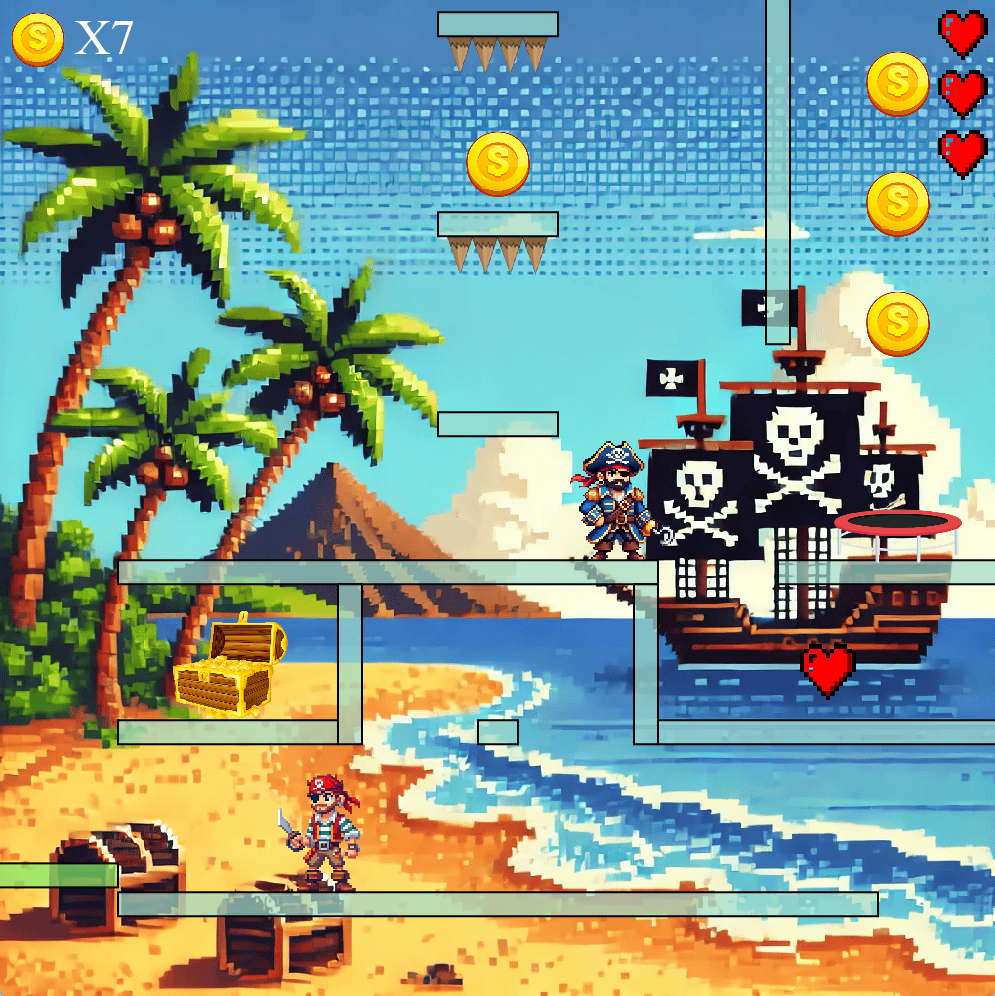
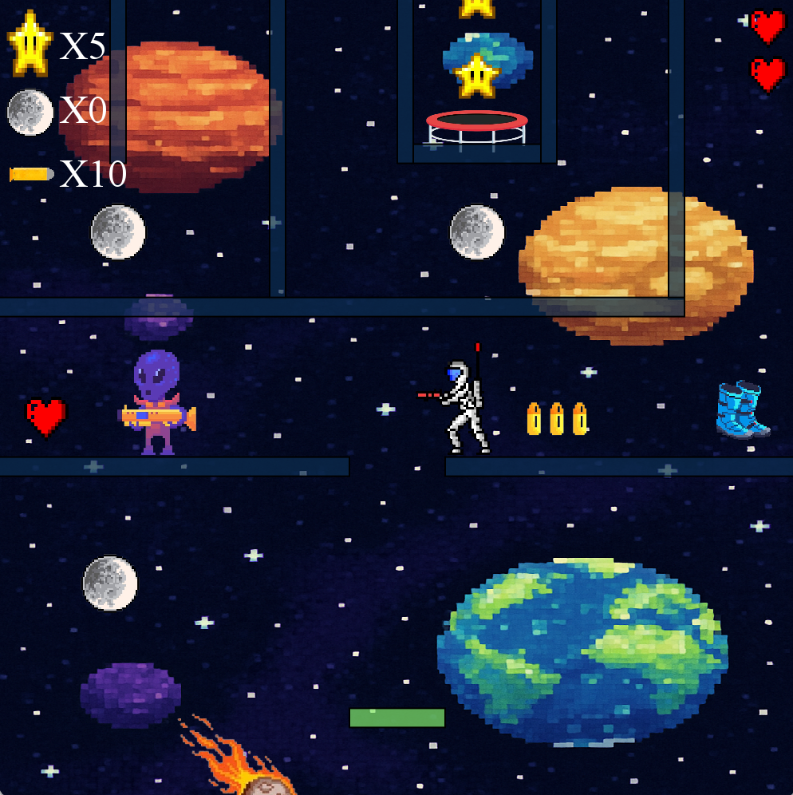
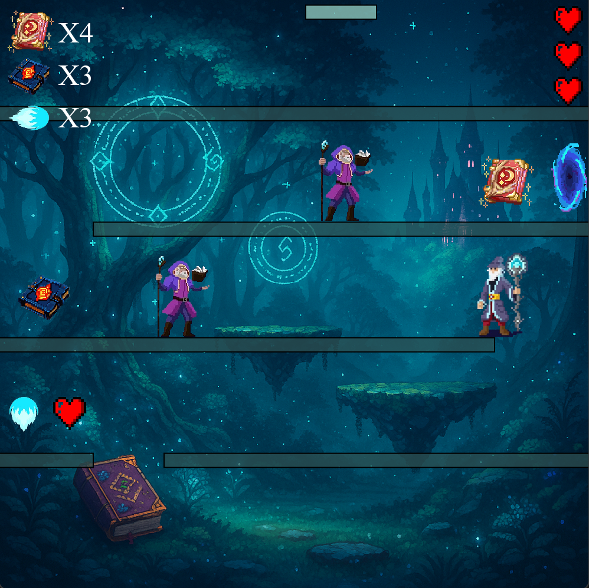

# Java Platformer Game

A **2D platformer game** built in **Java** using the **CityEngine** physics library, featuring multiple themed levels, 
interactive gameplay, and a polished GUI system

---

## 🎮 Features

- **Three uniquely designed levels**, each with its own theme:
  - 🏴‍☠️ **Pirate**
  - 🚀 **Space**
  - ✨ **Magic**
- **Player abilities**: movement, jumping, shooting (available in Levels 2 & 3), and interaction with the environment
- **Collectibles** such as coins, stars, books, gravity boots and more
- **Patrolling enemies** with collision mechanics
- **Health and lives system** for the player
- **Background music & sound effects** unique to each level
- **Main GUI**:
  - Play
  - Level selection
  - Instructions on how to play
  - Quit
- **Pause GUI**:
  - Resume gameplay
  - Toggle background music
  - Quit
- **HUD (Head-Up Display)** showing live player statistics
- **End-game statistics screen** displayed after completing all 3 levels

---

## 🕹️ Controls

| Key         | Action            |  
|-------------|-------------------|  
| **A / D**   | Move left / right |  
| **W**       | Jump              |  
| **Space**   | Shoot             |  
| **ESC / P** | Pause             |

---

## 🛠️ Technologies Used

### Core Language & APIs
- **Java** (Object-Oriented Programming, event-driven design, error handling)
- **Java Swing** (`JFrame`, `JPanel`, `Timer`, `KeyListener`, `MouseListener`, `ActionListener`, `ActionEvent`) for GUIs and input handling
- **Java AWT** (`Graphics`, `Color`, `Image`) for rendering and visuals
- **Java Sound API** (`javax.sound.sampled`) for audio playback
- **Java Collections Framework** (`ArrayList`, `HashMap`) for storing and managing game objects and sounds

### Frameworks & Libraries
- **CityEngine** (provided by City, University of London) – physics engine for 2D games
  - Includes support for `StepListener` (game loop updates) and `CollisionListener` (collision detection & handling)
- **JBox2D** (`org.jbox2d.common.Vec2`) – vector math for physics calculations

### Utilities
- **Exception handling** (`IOException`, `LineUnavailableException`, `UnsupportedAudioFileException`) for robust asset management

---

## ⚙️ Requirements

To run this project locally, you will need:

- **Java JDK 8+** installed and added to your system PATH
- **CityEngine Physics Library** (provided by City, University of London) – required for physics, collisions, and game engine features
- A Java-compatible IDE

> ⚠️ Note: The CityEngine library is not publicly distributed. You must have access through City, University of London for the project to compile and run

---

## 📖 What I Learned

- Applying **Object-Oriented Programming (OOP)** concepts (inheritance, polymorphism, abstraction, encapsulation) in a large-scale project
- Designing and structuring code into **modular packages** (`core`, `level1`, `level2`, `level3`) for maintainability
- Managing **game states and transitions** (switching levels, handling resources, and ensuring performance)
- Implementing **event-driven programming** via listeners:
  - **Java Swing / AWT** → `KeyListener`, `MouseListener`, `ActionListener`, `ActionEvent` (GUI & user input)
  - **CityEngine** → `StepListener`, `CollisionListener` (game physics & collision handling)
- Creating a polished **user interface (GUI)** using Java Swing components
- Handling **multimedia assets** (images, sounds, and music) with appropriate error handling and fallbacks
- Writing **comprehensive documentation** with Javadocs and inline comments to ensure clarity for future maintainers

---

## 🖼️ Screenshots

- Level 1 Gameplay:

- Level 2 Gameplay:

- Level 3 Gameplay:

--- 

## 📌Future Improvements

- **Save & Load System** → Extend the GUI to allow saving/loading player progress, scores, and attributes
- **Smarter Enemy AI** → Enable enemies to **actively attack the player** (ranged/projectile attacks) rather than only causing damage on contact
- **Enhanced Animations** → Improve player and enemy sprite animations for smoother and more lifelike movement

---

## 🙏 Acknowledgements

Some utility classes (e.g., **PolygonEditor**) were provided by **City, University of London** as part of the coursework framework
These tools were used to create precise hitboxes and collision outlines for in-game objects, ensuring accurate physics interactions

---

## 🧑‍💻 Author

Developed by **Abdus-Samad Mohit**
- [LinkedIn](https://linkedin.com/in/samad-m)
- [GitHub](https://github.com/Samad-M3)

---